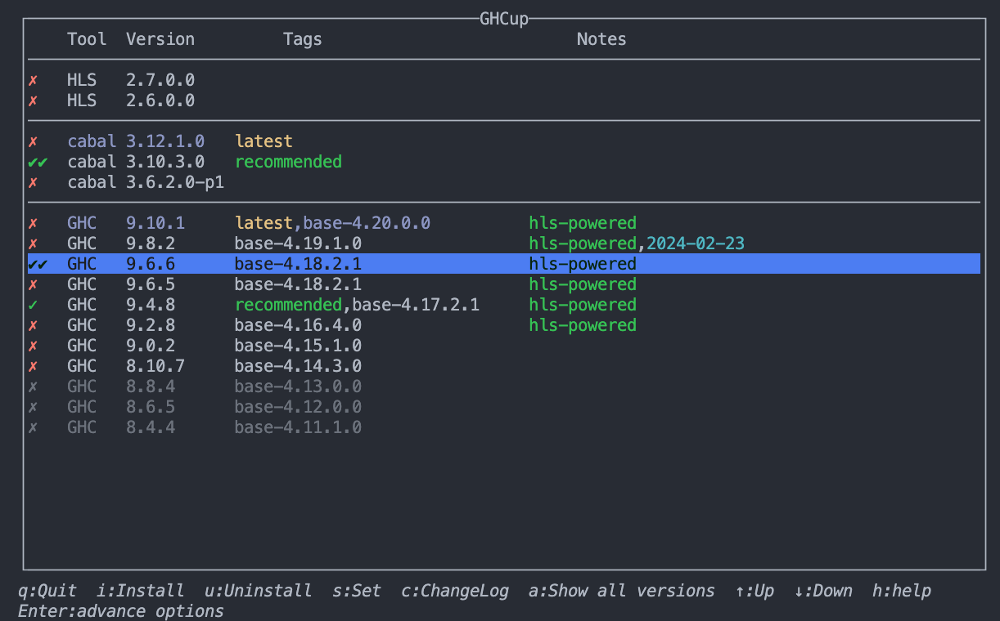

## Install
### Install GHCup
#### MacOS, Linux
```bash
curl --proto '=https' --tlsv1.2 -sSf https://get-ghcup.haskell.org | sh
```
#### Windows
```powershell
Set-ExecutionPolicy Bypass -Scope Process -Force;[System.Net.ServicePointManager]::SecurityProtocol = [System.Net.ServicePointManager]::SecurityProtocol -bor 3072; try { & ([ScriptBlock]::Create((Invoke-WebRequest https://www.haskell.org/ghcup/sh/bootstrap-haskell.ps1 -UseBasicParsing))) -Interactive -DisableCurl } catch { Write-Error $_ }
```

### Install correct compiler
Select `GHC 9.6.6`, keyboard input i, then keyboard input s.


### Check version
```bash
ghc --version
# The Glorious Glasgow Haskell Compilation System, version 9.6.6
```

## Introduction
### GHCi
A shell like interpreter.
```bash
ghci
```

### GHC
Compiler for Haskell.
```haskell
-- Create a new file called Hello.hs
main :: IO ()
main = putStrLn "Hello World!"
```
```bash
ghc Hello.s && ./a.out
```
